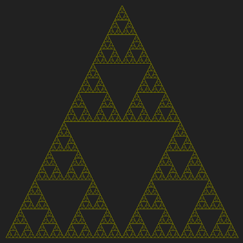
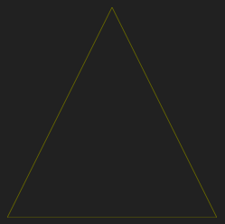
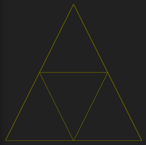
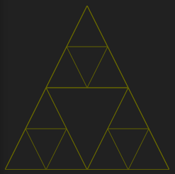
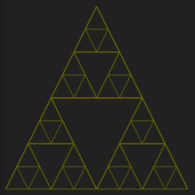
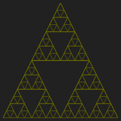

# Sierpinski triangle

Canvas fun, December 2022.

https://lysebo.xyz/misc/sierpinski/

The Sierpinski Triangle is a fractal consisting of triangles inside triangles inside triangles..

To construct it, start with the outer triangle:

Add a point halfway across every line and connect the dots,
creating 4 smaller triangles:

Repeat the process for each of the 3 outer triangles (not the center triangle): 

And so on:

And so on:

## animation

I wanted to make an animation that dives deeper and deeper inside the fractal.

Triangles are pre-generated down to a certain depth. The coordinates to the lines in each triangle are percentages of the viewport. This makes it easy to change viewport and offset without having to re-calculate the triangle positions.

The animation draws all triangles, and then draws the same triangles in the lower right quadrant of the previous draw, and so on for 6 levels. This is enough to make it seem like there are an infinite number of trangles.

Animation is done by moving the origin and expanding the viewport.
When the offset drops below -100%, we've reached a full cycle. The viewport and offset are then reset, making it look like an endless animation.

To make a smooth transition from one cycle to the next, some magic needs to be applied. The offset needs to be adjusted somewhat for each iteration, and the magic number needs to be increased with 0.3 every time it is used. Otherwise, the movement will slow down towards the end of each cycle, making the overlap a bit bumpy. I tried different approaches to fix this without the use of magic numbers, but suspect that there might be some decimal inaccuracies involved.

## install

Open `app/index.html` in your browser.

or

`npm install` and `node watch.js` to launch browser-sync.
